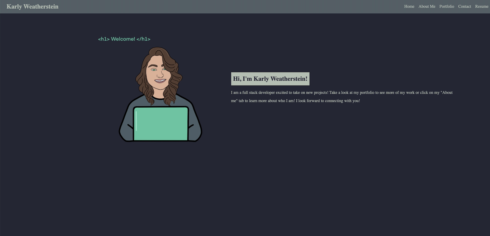

# Portfolio

## A website to showcase all of my projects and skills.

## The goal is to showcase my skills

- This application covers everything about me - from my skills to my interests to contacting me! Feel free to checkout all of my links to see my works or socials.

## GIVEN I need to sample a potential employee's previous work

- WHEN I load their portfolio

  THEN I am presented with the developer's name, a recent photo or avatar, and links to sections about them, their work, and how to contact them

- WHEN I click one of the links in the navigation

  THEN the UI scrolls to the corresponding section

- WHEN I click on the link to the section about their work

  THEN the UI scrolls to a section with titled images of the developer's applications

- WHEN I click on the images of the applications

  THEN I am taken to that deployed application

- WHEN I resize the page or view the site on various screens and devices

  THEN I am presented with a responsive layout that adapts to my viewport

URL: https://karlyweatherstein.github.io/portfolio/
